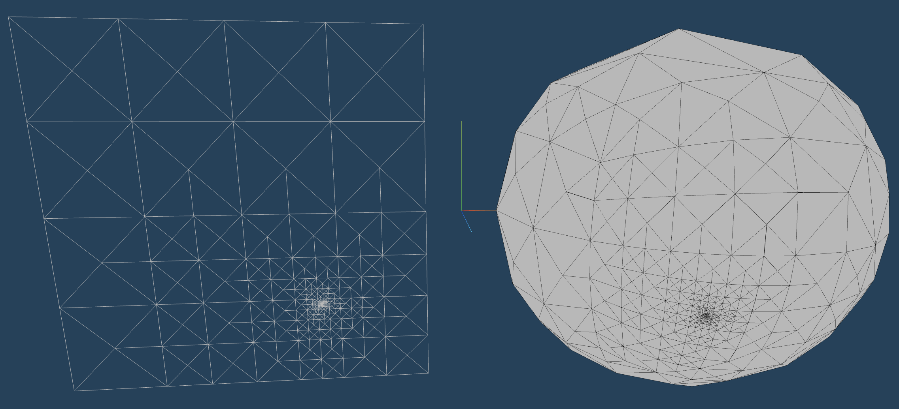

# QuadSphere
> @Created: 29 Oct. 2018 (Unity version)

> @Updated: 2023 (Threejs & @react-three/fiber)

>@Author: Jason Holt Smith (<bicarbon8@gmail.com>)

## Description

A QuadSphere (a sphere made up of a mesh cube whose vertices are adjusted into a spherical shape) with QuadTree-based level of detail support.



## Installation
TBD

## Usage
```typescript
import { useLoader } from '@react-three/fiber';

function App() {
    const texture = useLoader(THREE.TextureLoader, `./assets/texture.png`);
    const bump = useLoader(THREE.TextureLoader, `./assets/bump.jpg`);
    return (
        <QuadSphereMesh
            position={[1.2, 0, 0]} {/* x, y, z position */}
            radius={1}>            {/* radius of sphere */}
            <meshStandardMaterial 
                map={texture} 
                displacementMap={bump}
                displacementScale={0.2} />
        </QuadSphereMesh>
    )
}
```